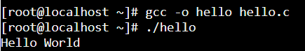
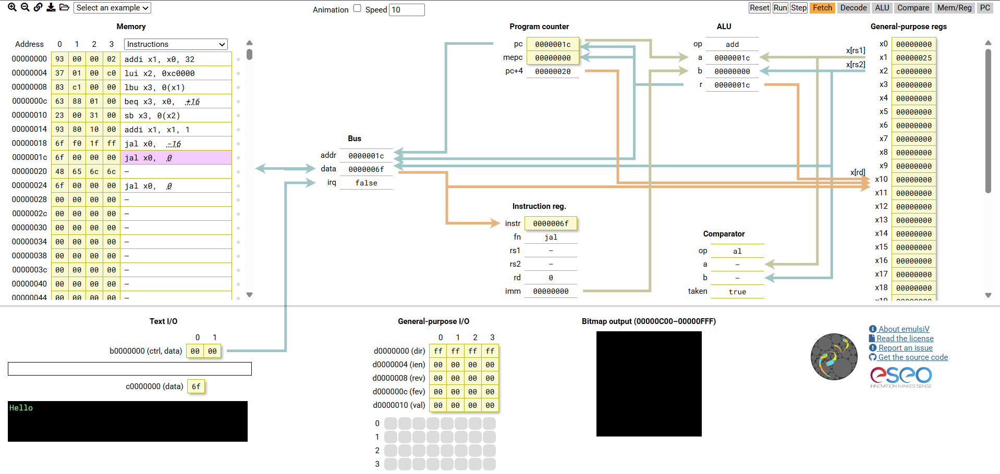
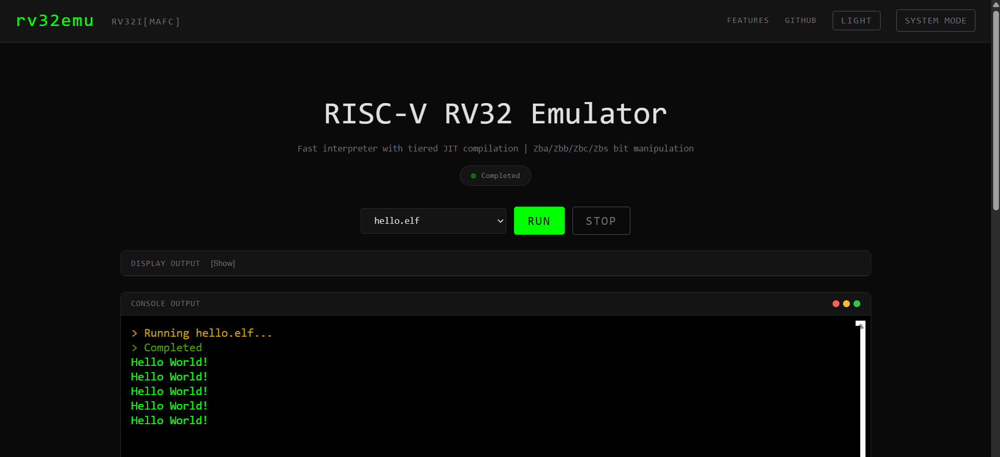

# Lab 0: Web-based RISC-V Emulators

Date: September 26, 2026

This note records my practice with the three browser-based tools introduced in [Lab 0](https://hackmd.io/@sysprog/SJ7ht_MuS): JSLinux, emulsiV, and rv32emu.

## 1. JSLinux

I selected the riscv64 Buildroot Linux console on [JSLinux](https://bellard.org/jslinux/).

### Environment

I inspected the simulated system using:

```sh
uname -a
cat /proc/cpuinfo
cat /proc/meminfo
gcc -dumpmachine
```

| Item | Observed value |
|---|---|
| Architecture | riscv64 |
| Kernel version | 4.15.0-00049-ga3b1e7a-dirty |
| ISA reported by Linux | rv64acdfimsu |
| MMU | sv48 |
| MemTotal | 251980 kB |
| GCC target | riscv64-buildroot-linux-gnu |

These values describe the simulated system, not my physical computer.

### Compiling and Running C

I inspected the existing `hello.c` with nano and used it without modifying its contents.

```sh
gcc -o hello hello.c
./hello
```

The program printed:

```text
Hello World
```

The GCC command generated an executable named `hello`. Compilation produced no terminal output, while `./hello` ran the executable and displayed its message.

I also tried `file hello`, but the environment reported `file: not found`. I used `gcc -dumpmachine` to check the compiler's target platform instead. This reports compiler configuration rather than inspecting the executable itself.



## 2. emulsiV

I used [emulsiV](https://eseo-tech.github.io/emulsiV/) to step through the loaded string-output example.

The important operations were:

- `addi x1, x0, 32` placed the string address `0x20` in `x1`.
- `lui x2, 0xc0000` placed the output-device address `0xc0000000` in `x2`.
- `lbu x3, 0(x1)` read one byte from the string and zero-extended it.
- `beq` checked whether the byte was the zero terminator.
- `sb x3, 0(x2)` wrote the character to the text-output device.
- Incrementing `x1` advanced to the next character.

The output accumulated from `H` to `He` and eventually `Hello`.

After reaching the string terminator, the program jumped to address `0x1c`, where `jal x0, 0` repeatedly jumped to itself. The PC therefore remained at `0x1c`; the program was looping rather than exiting.

This exercise helped me distinguish a memory address from the value stored at that address.



## 3. rv32emu

I opened the [rv32emu demo](https://sysprog21.github.io/rv32emu-demo/), selected User Mode, and ran the provided `hello.elf`.

The page displayed `Completed`, and the console showed five lines of:

```text
Hello World!
```

This was a precompiled example provided by the website, separate from the executable I built in JSLinux.



## What I Practiced

| Tool | Practice |
|---|---|
| JSLinux | Inspecting a Linux environment and compiling a C program |
| emulsiV | Tracing instructions, registers, memory accesses, and branches |
| rv32emu | Running a provided RISC-V ELF executable |

I used existing examples for these introductory exercises. I did not modify the emulator implementations or perform performance measurements.
